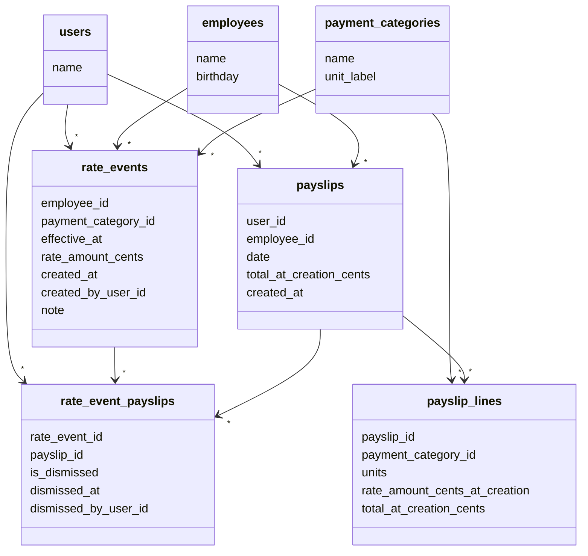

# Finito — Home Assignment

## ER-диаграмма базы данных



## Итоговая рекомендация по модели данных

Главное решение: **ставки хранятся как append-only история событий**, а не как одна текущая запись.

```text
rate_events = "starting from effective_at, rate for this employee/category is rate_amount_cents"
```

Это хорошо подходит для time travel и ретроактивных изменений:

- чтение ставки “as of date” = взять последнее событие с `effective_at <= date`;
- изменение ставки = вставить новое событие, старые не переписывать;
- ретроактивное изменение payslip = найти post-creation rate event, который теперь применяется к payslip date;
- dismissal = не удалять rate event, а отметить, что для конкретного payslip этот event игнорируется.

---

## Хранение денег и единиц

В БД используются целые числа:

```text
units INTEGER
rate_amount_cents INTEGER
```

Правила:

```text
units = целое количество minor units категории
rate_amount_cents = копейки/центы за одну такую minor unit
line_total_cents = units * rate_amount_cents
```

Для time-based категорий в этой реализации minor unit = **час**.

Пример:

```text
Hourly Rate:
  units = 2                -- 2 часа
  rate_amount_cents = 1200 -- 1200 cents/hour = $12/hour
  line_total_cents = 2 * 1200 = 2400 cents = $24.00
```

### Округление

Так как `units` и `rate_amount_cents` целые, итог строки всегда целый в копейках/центах:

```text
line_total_cents = units * rate_amount_cents
```

Если UI/API принимает ставку в более крупной единице, например `$10/hour`, а категория использует часы, ставка обычно уже находится в `rate_amount_cents` per hour.

Правило округления:

```text
round half up / round half away from zero
```

Для положительных сумм:

```text
rounded = floor(value + 0.5)
```

Пример:

```text
$10/hour = 1000 cents/hour
rate_amount_cents = 1000 cents/hour
```

Если в будущем потребуется точное представление ставок меньше одной копейки/цента за час, нужно будет перейти на более мелкую шкалу, например `rate_amount_microcents` или `rate_amount_micros`.

---

## Сущности

```text
users
employees
payment_categories
rate_events
payslips
payslip_lines
rate_event_payslips
```

### `users`

Один фиксированный пользователь. Auth не нужен, но payslips хранят ссылку на пользователя, который их создал.

### `employees`

Сотрудники. Seed-данные уже есть в `initial.sql`.

### `payment_categories`

Категории оплаты: Hourly Rate, Overtime Hourly, Commission, Global Pay.

### `rate_events`

История изменений ставок.

Важно:

```text
rate_events.rate_amount_cents = cents per minor unit of the payment category
```

Например, если категория использует часы, то `rate_amount_cents` — копейки/центы за час.

### `payslips`

Payslip immutable после создания.

Хранит:

```text
original total at creation
created_at
employee_id
user_id
date
```

`current_total` не хранится, потому что он меняется при новых rate events и dismissal.

### `payslip_lines`

Строки payslip.

```text
payment_category_id
units
rate_amount_cents_at_creation
total_at_creation_cents
```

`rate_amount_cents_at_creation` и `total_at_creation_cents` нужны как snapshot, чтобы всегда показывать original total.

Дубликаты категории внутри payslip запрещены:

```text
UNIQUE (payslip_id, payment_category_id)
```

### `rate_event_payslips`

Связка rate events и payslips. Заполняется при создании rate event для всех затронутых payslips.

```text
rate_event_id + payslip_id
```

Семантика:

```text
This rate_event affects this payslip. If is_dismissed = true, ignore it when recalculating current total.
```

Поля:

- `is_dismissed` — флаг dismissal (заменяет отдельную таблицу `payslip_dismissed_rate_events`)
- `dismissed_at`, `dismissed_by_user_id` — метаданные dismissal

Почему связка вместо отдельной таблицы dismissal:

- Все rate events, влияющие на payslip, уже в связке
- Dismissal = флаг `is_dismissed` на существующей строке
- При чтении: текущая ставка = последний non-dismissed по `effective_at DESC`
- При dismissal: следующий non-dismissed автоматически становится текущим

---

## Схема БД

Схема и seed-данные находятся в:

```text
initial.sql
```

Ключевые таблицы:

```sql
CREATE TABLE rate_events (
  id INTEGER PRIMARY KEY,

  employee_id INTEGER NOT NULL REFERENCES employees(id),
  payment_category_id INTEGER NOT NULL REFERENCES payment_categories(id),

  effective_at TEXT NOT NULL,
  rate_amount_cents INTEGER NOT NULL CHECK (rate_amount_cents >= 0),

  created_at TEXT NOT NULL,
  created_by_user_id INTEGER NOT NULL DEFAULT 1 REFERENCES users(id),

  note TEXT
);

CREATE TABLE payslips (
  id INTEGER PRIMARY KEY,

  user_id INTEGER NOT NULL REFERENCES users(id),
  employee_id INTEGER NOT NULL REFERENCES employees(id),

  date TEXT NOT NULL,
  total_at_creation_cents INTEGER NOT NULL CHECK (total_at_creation_cents >= 0),

  created_at TEXT NOT NULL
);

CREATE TABLE payslip_lines (
  id INTEGER PRIMARY KEY,

  payslip_id INTEGER NOT NULL REFERENCES payslips(id) ON DELETE CASCADE,
  payment_category_id INTEGER NOT NULL REFERENCES payment_categories(id),

  units INTEGER NOT NULL CHECK (units > 0),

  rate_amount_cents_at_creation INTEGER NOT NULL CHECK (rate_amount_cents_at_creation >= 0),
  total_at_creation_cents INTEGER NOT NULL CHECK (total_at_creation_cents >= 0),

  UNIQUE (payslip_id, payment_category_id),
  CHECK (total_at_creation_cents = units * rate_amount_cents_at_creation)
);

CREATE TABLE rate_event_payslips (
  rate_event_id INTEGER NOT NULL REFERENCES rate_events(id) ON DELETE CASCADE,
  payslip_id INTEGER NOT NULL REFERENCES payslips(id) ON DELETE CASCADE,
  is_dismissed INTEGER NOT NULL DEFAULT 0,
  dismissed_at TEXT,
  dismissed_by_user_id INTEGER REFERENCES users(id),
  PRIMARY KEY (rate_event_id, payslip_id)
);
```

---

## Эффективная дата / time travel

Эффективная дата не хранится в БД как глобальное состояние. Она приходит из UI/API при чтении или записи.

### Чтение ставок as of date

Чтобы показать ставки сотрудника на дату:

```sql
SELECT
  pc.id AS payment_category_id,
  pc.name AS payment_category_name,
  e.rate_amount_cents
FROM payment_categories pc
LEFT JOIN rate_events e
  ON e.id = (
    SELECT e2.id
    FROM rate_events e2
    WHERE e2.employee_id = :employee_id
      AND e2.payment_category_id = pc.id
      AND e2.effective_at <= :as_of_date
    ORDER BY e2.effective_at DESC, e2.created_at DESC, e2.id DESC
    LIMIT 1
  )
ORDER BY pc.id;
```

Если `rate_amount_cents` равен `NULL`, ставки на эту дату ещё нет.

### Запись ставки

Когда пользователь выбирает effective date `D` и сохраняет ставку, приложение делает только INSERT:

```sql
INSERT INTO rate_events (
  employee_id,
  payment_category_id,
  effective_at,
  rate_amount_cents,
  created_at,
  created_by_user_id,
  note
)
VALUES (
  :employee_id,
  :payment_category_id,
  :effective_date,
  :rate_amount_cents,
  strftime('%Y-%m-%dT%H:%M:%fZ', 'now'),
  1,
  :note
);
```

Старые rate events не обновляются и не удаляются.

---

## Создание payslip

Алгоритм:

1. Получить `employee_id`, `date`, `user_id`, список line items.
2. Проверить, что внутри payslip нет дубликатов `payment_category_id`.
3. Для каждой line item:
   - найти ставку по employee/category на `payslip.date`;
   - если ставки нет — вернуть ошибку;
   - посчитать `line_total_cents = units * rate_amount_cents`.
4. Посчитать `payslip_total_cents = sum(line_total_cents)`.
5. В одной транзакции:
   - вставить payslip с `total_at_creation_cents`;
   - вставить payslip lines со snapshot ставки и snapshot total.

Пример SQL для поиска ставки:

```sql
SELECT e.*
FROM rate_events e
WHERE e.employee_id = :employee_id
  AND e.payment_category_id = :payment_category_id
  AND e.effective_at <= :payslip_date
ORDER BY e.effective_at DESC, e.created_at DESC, e.id DESC
LIMIT 1;
```

Payslip после создания не редактируется.

---

## Ретроактивно изменённый payslip

Payslip считается ретроактивно изменённым, если:

```text
1. есть rate event для той же employee/payment category;
2. event.effective_at <= payslip.date;
3. event.created_at > payslip.created_at;
4. event не dismissed для этого payslip;
5. current_total_cents != original_total_cents.
```

SQL для поиска таких payslips (через связку rate_event_payslips):

```sql
SELECT p.id
FROM payslips p
JOIN payslip_lines pl
  ON pl.payslip_id = p.id
WHERE EXISTS (
  SELECT 1
  FROM rate_event_payslips rep
  JOIN rate_events re
    ON re.id = rep.rate_event_id
  WHERE rep.payslip_id = p.id
    AND re.employee_id = p.employee_id
    AND re.payment_category_id = pl.payment_category_id
    AND rep.is_dismissed = 0
)
GROUP BY p.id;
```

---

## Current total

`current_total` вычисляется на лету.

Для каждой payslip line нужно найти последний non-dismissed rate event из связки:

```sql
SELECT re.rate_amount_cents
FROM rate_event_payslips rep
JOIN rate_events re
  ON re.id = rep.rate_event_id
WHERE rep.payslip_id = :payslip_id
  AND re.payment_category_id = :payment_category_id
  AND rep.is_dismissed = 0
ORDER BY re.effective_at DESC, re.created_at DESC, re.id DESC
LIMIT 1;
```

Затем:

```text
current_line_total_cents = units * current_rate_amount_cents
current_payslip_total_cents = sum(current_line_total_cents)
```

Если rate event не найден, payslip не может быть корректно пересчитан. В приложении это нужно показать как ошибку состояния данных.

---

## Dismissal

Dismissal не удаляет rate event. Он только исключает event из пересчёта конкретного payslip.

### Найти most recent rate edit, который можно dismiss

В этой реализации “most recent rate edit” означает самый поздний по времени создания редактирования, то есть `created_at DESC`.

```sql
SELECT re.*
FROM rate_event_payslips rep
JOIN rate_events re
  ON re.id = rep.rate_event_id
WHERE rep.payslip_id = :payslip_id
  AND rep.is_dismissed = 0
ORDER BY re.created_at DESC, re.effective_at DESC, re.id DESC
LIMIT 1;
```

Если продукт захочет трактовать "most recent" как "latest effective date", нужно поменять порядок сортировки на:

```sql
ORDER BY re.effective_at DESC, re.created_at DESC, re.id DESC
```

Но для ТЗ более прямая трактовка — “edit made after payslip was created”, поэтому default choice: `created_at DESC`.

### Dismissal

```sql
UPDATE rate_event_payslips
SET is_dismissed = 1,
    dismissed_at = strftime('%Y-%m-%dT%H:%M:%fZ', 'now'),
    dismissed_by_user_id = 1
WHERE rate_event_id = :rate_event_id
  AND payslip_id = :payslip_id
  AND is_dismissed = 0;
```

После этого current total пересчитывается автоматически — следующий non-dismissed event по `effective_at DESC` становится текущей ставкой.

---

## Эффективность

Базовый вариант:

- rate resolution: `O(log n)` для одного employee/category/date благодаря индексу;
- payslip list: пересчёт по строкам payslip через связку rate_event_payslips (один JOIN вместо сканирования всех rate events);
- dismissal: UPDATE одной строки в rate_event_payslips.

Индексы в `initial.sql` покрывают основные запросы:

```text
rate_events(employee_id, payment_category_id, effective_at DESC, created_at DESC, id DESC)
rate_events(created_at, employee_id, payment_category_id, effective_at DESC)
payslips(created_at)
payslip_lines(payslip_id)
rate_event_payslips(payslip_id)
```

Если payslips станет очень много, следующим шагом можно добавить materialized projection:

```text
payslip_current_totals(payslip_id, current_total_cents, changed_at_rate_event_id)
```

и обновлять её при rate events/dismissals. Но для home assignment current total лучше вычислять из событий, чтобы не плодить скрытую mutable state.

---

## Seed-данные

`initial.sql` создаёт:

```text
1 user
3 employees
4 payment categories
несколько baseline rate_events
```

Baseline rate events нужны, чтобы после инициализации БД можно было сразу создавать payslips.

---

## Как запускать

```bash
sqlite3 finito.db < initial.sql
```

Если файл БД уже существует и нужно пересоздать:

```bash
rm finito.db
sqlite3 finito.db < initial.sql
```

---

## Как тестировать

Минимальный сценарий:

1. Создать rate event для John / Hourly Rate effective `2026-02-01` на `1200 cents/hour`.
2. Создать payslip для John dated `2026-02-01` на `100 hours`.
3. Проверить:
   - `original_total_cents = 120000`;
   - `current_total_cents = 120000`;
   - payslip не подсвечен.
4. Создать rate event effective `2026-01-01` на `1500 cents/hour`.
5. Проверить:
   - current rate для payslip стала `1500 cents/hour`;
   - `current_total_cents = 150000`;
   - payslip подсвечен как retroactively changed.
6. Dismiss most recent rate edit.
7. Проверить:
   - dismissed event игнорируется;
   - current total вернулся к `2000`;
   - payslip больше не подсвечен.

Дополнительные тесты:

```text
- нельзя создать payslip, если для категории нет ставки на payslip.date;
- нельзя создать payslip с двумя строками одной payment_category_id;
- rate read as of date возвращает последнее событие effective_at <= date;
- dismissal не удаляет rate event глобально;
- dismissal одного payslip не влияет на другие payslips;
- payslip original total остаётся неизменным после rate edits.
```

---

## Design choices

### Почему rate_events, а не valid_from/valid_to

Плохой вариант:

```text
rates(employee_id, category_id, amount, valid_from, valid_to)
```

При ретроактивной вставке пришлось бы сплитить старые интервалы и переписывать `valid_to`.

Лучше:

```text
rate_events(employee_id, category_id, effective_at, rate_amount_cents, created_at)
```

Это проще, audit-friendly и естественно поддерживает time travel.

### Почему original total хранится отдельно

`payslips.total_at_creation_cents` и `payslip_lines.rate_amount_cents_at_creation` — immutable snapshot.

Он нужен, чтобы показывать:

```text
original total vs current total
```

### Почему current total не хранится

Current total зависит от:

```text
rate_events
dismissals
```

Если хранить его отдельно, нужно синхронно обновлять при каждом rate event и dismissal. Для этой задачи проще и безопаснее вычислять его на лету.

### Почему dismissal = payslip_id + rate_event_id

Пользователь dismiss-ит изменение для payslip.

`rate_event_id` уже содержит:

```text
employee_id
payment_category_id
effective_at
rate_amount_cents
```

А запрет дубликатов категории внутри payslip делает модель точной и простой.

---

## Что можно улучшить с большим количеством времени


- Добавить миграции вместо одного initial.sql.
- Добавить audit log для dismissal и rate edits.
- Добавить background/materialized current totals для больших объёмов payslips.
- Добавить более точную денежную шкалу, если нужны ставки вроде $10/hour в минутах без округления.
- Добавить validation triggers для dismissal.
- Добавить UI для employees/categories, если это потребуется.
- Добавить тесты на уровне API/e2e.
- npm audit fixes 
- drizzle migrations (not implemented for demo level)
- minor: rename db entities names from plural to singular (as more traditional approach)
- refactor: add react-router
- refactor: use library for dates human-readable formatting
- improve: after modifying rates refresh only affected payslips 
- improve: time-travel for payslips too. Note: I made conclusion this didn't required because in chapter "Effective date selector (“time travel”)" its affect was described only for the rates but not payslips
- security issue: deny to dismiss *not* the most recent retroactive change (experienced user can make it)
- improve: don't create retroactive changes that would be overloaded by another retroactive changes (for example closer to payslip date)
- 
- в список retroactive rate changes попадают все post-creation rate events, даже если они не влияют на текущую ставку (например, перекрыты более поздним edit'ом). Можно заменить on-the-fly пересчёт на материализованную связку rate_event_payslips, заполняемую при создании rate event — это упростит read-path и уберёт некорректную фильтрацию
- could be make more precise: rate_events_payslips link table could be made for rate events and payslips, to track which events affect which payslips
- improve checking if rate edit affect on payslip: except effective date also consider payment categories
- refactor: dismissRateEditForPayslip(payslipId, rateEditId) actually doesn't requires rateEditId (ir should just detect most recent rate edit for payslip on server)
- refactor: good css styling without duplicate etc
- refactor: DRY for trivial cases in code (like functions  formatRelativeTime, formatRelativeTime, getTodayString etc)
- improve: use tRPC for server-client communication
- improve: use db user everywhere instead of consts

---

## Prompt для ИИ-реализации

Используй схему из `initial.sql`.

Реализуй app так:

```text
1. Rate events are append-only.
2. rate_events.rate_amount_cents means cents per minor unit of the payment category.
3. For time-based categories, units are hours.
4. payslip_lines.units must be INTEGER and > 0.
5. payslip_lines must have UNIQUE(payslip_id, payment_category_id).
6. payslips are immutable after creation.
7. payslips store original total_at_creation_cents.
8. current_total is computed from rate_events and payslip_dismissed_rate_events.
9. Dismissal is stored as payslip_id + rate_event_id.
10. Dismissal does not delete rate_events.
11. A retroactively changed payslip has at least one non-dismissed rate_event where:
    - same employee/category as a payslip line
    - event.effective_at <= payslip.date
    - event.created_at > payslip.created_at
    - current_total_cents != original_total_cents
12. “Most recent dismissable rate edit” means ORDER BY created_at DESC, effective_at DESC, id DESC.
13. Rate resolution means ORDER BY effective_at DESC, created_at DESC, id DESC.
14. If a rate is missing for a payslip line date, reject payslip creation or show a data error.
15. Do not overwrite old rate_events.
16. Do not store mutable current_total in payslips.
```
