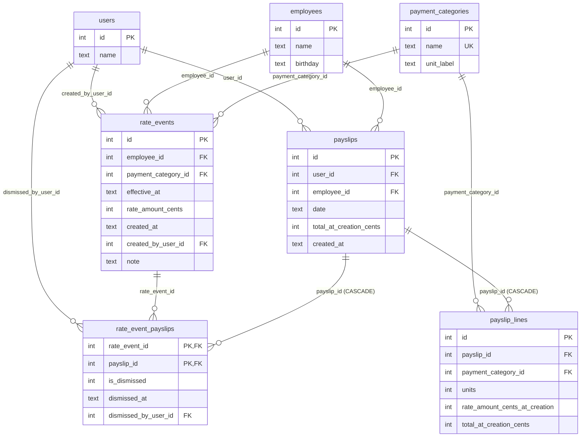

# Payslippers — Finito Home Assignment

A payroll workbench for managing employee rates, creating time-aware payslips, and detecting retroactive changes when rates are edited.

Built with **Next.js 16**, **TypeScript**, **Drizzle ORM**, **better-sqlite3**, **tRPC-style server actions**, and **Tailwind CSS 4**.

---

## Table of Contents

- [Description](#description)
- [Database Schema](#database-schema)
- [Design Choices](#design-choices)
- [Getting Started](#getting-started)
- [Running Tests](#running-tests)
- [What I Would Change With More Time](#what-i-would-change-with-more-time)

---

## Description

Payslippers is a single-dashboard app for payroll specialists. It solves a core problem in payroll systems: **rates change over time, and those changes can retroactively affect previously issued payslips**.

The app provides:

1. **Rate management** — View and edit what an employee earns per unit of a payment category (e.g. hourly rate, overtime, commission). Rates are time-aware: each edit records "starting on date D, the rate is X."

2. **Payslip creation** — Pick an employee, pick a date, add line items with payment categories and units. The total is computed from the rates that apply on the payslip's date. Payslips are immutable after creation.

3. **Effective date selector ("time travel")** — A sticky date control at the top of the screen. Reading shows rates as they are on that date. Writing makes rate edits apply starting from that date.

4. **Retroactive change detection** — When a rate edit is made effective *before* an existing payslip's date, that payslip is highlighted. Both the original total and the current (recalculated) total are shown.

5. **Dismiss retroactive changes** — For a highlighted payslip, dismiss the most recent rate edit affecting it. If multiple edits affect the same payslip, they are dismissed one at a time, most-recent first.

---

## Database Schema

The database has 7 tables with the following entity-relationship diagram:



### Key constraints

| Constraint | Table | Purpose |
|---|---|---|
| `CHECK (rate_amount_cents >= 0)` | `rate_events` | No negative rates |
| `CHECK (units > 0)` | `payslip_lines` | Positive units only |
| `CHECK (total_at_creation_cents = units * rate_amount_cents_at_creation)` | `payslip_lines` | Line total integrity |
| `UNIQUE (payslip_id, payment_category_id)` | `payslip_lines` | No duplicate categories per payslip |
| `PRIMARY KEY (rate_event_id, payslip_id)` | `rate_event_payslips` | One link per event-payslip pair |
| `CHECK (id = 1)` | `users` | Single fixed user |
| Trigger `validate_rate_event_payslip_insert` | `rate_event_payslips` | Only links where event.employee = payslip.employee, event.category = line.category, and event.effective_at <= payslip.date |

### Indexes

| Index | Table | Columns | Purpose |
|---|---|---|---|
| `idx_rate_events_as_of` | `rate_events` | `employee_id, payment_category_id, effective_at DESC, created_at DESC, id DESC` | Fast "rate as of date" lookups |
| `idx_rate_events_created_after` | `rate_events` | `created_at, employee_id, payment_category_id, effective_at DESC` | Retroactive change detection |
| `idx_payslips_created_at` | `payslips` | `created_at` | Ordering payslips by creation time |
| `idx_payslips_employee_date` | `payslips` | `employee_id, date` | Filtering payslips by employee and date |
| `idx_payslip_lines_payslip` | `payslip_lines` | `payslip_id` | Fetching line items for a payslip |
| `idx_rate_event_payslips_payslip_id` | `rate_event_payslips` | `payslip_id` | Resolving retroactive edits for a payslip |

---

## Design Choices

### Why `rate_events` (append-only) instead of `valid_from` / `valid_to`

A `valid_from/valid_to` model requires splitting existing intervals when inserting a retroactive rate change — error-prone and audit-unfriendly. With append-only events, a rate edit is always a new `INSERT`. The "current" rate is the latest event where `effective_at <= as_of_date`. This naturally supports time travel and retroactive detection.

### Why `original_total` is stored separately

`payslips.total_at_creation_cents` and `payslip_lines.rate_amount_cents_at_creation` are immutable snapshots taken at creation time. They are needed to always show "original total vs current total" regardless of future rate edits.

### Why `current_total` is not stored

Current total depends on the set of active (non-dismissed) rate events. Storing it would require updating it on every rate edit and dismissal — introducing mutable state that can drift. Computing it from the event log is simpler and always correct.

### Why dismissal is a flag on `rate_event_payslips`

The link table already connects rate events to the payslips they affect. Dismissal is simply `is_dismissed = 1` on that row. This means:
- The rate event is never deleted or modified globally.
- Dismissal for one payslip has no effect on others.
- After dismissal, the next non-dismissed event (by `effective_at DESC`) automatically becomes the current rate.

### Rate resolution sort order

- **Reading a rate** (as-of date): `effective_at DESC, created_at DESC, id DESC`
- **Dismissal** ("most recent"): `effective_at DESC, created_at DESC, id DESC`

Both use the same ordering for consistency.

### Money storage

All monetary values are stored as integers in cents (`rate_amount_cents`, `total_at_creation_cents`). Units are integers. Line totals are `units * rate_amount_cents` — always exact, no floating-point rounding.

---

## Getting Started

### Prerequisites

- **Node.js** 20+
- **npm** (or yarn/pnpm/bun)

### Installation

```bash
cd apps/web
npm install
```

### Database Setup

The app uses a local SQLite database (`local.db`). To create the schema and seed initial data:

```bash
# Create the schema and seed in one step
npm run db:setup
```

To start fresh (deletes existing DB, then creates schema and seeds):

```bash
npm run db:recreate
```

### Running the App

```bash
npm run dev
```

Open [http://localhost:3000](http://localhost:3000) in your browser.

### Other Database Commands

| Command | Description |
|---|---|
| `npm run db:setup` | Create schema from `initial.sql` and seed (safe to re-run) |
| `npm run db:recreate` | Delete `local.db`, then run `db:setup` |
| `npm run db:seed` | Insert seed data only (idempotent — skips if already seeded) |
| `npm run db:reset` | Delete all data, keep schema |
| `npm run db:push` | Push Drizzle schema to the database |
| `npm run db:console` | Open SQLite CLI on `local.db` |
| `npm run db:studio` | Open Drizzle Studio (visual DB browser) |

---

## Running Tests

Tests are written with **Vitest** and cover the core server actions (`rates.ts` and `payslips.ts`). They require a seeded database.

```bash
# Make sure the database is set up first
npm run db:setup

# Run all tests
npx vitest run

# Run with watch mode
npx vitest
```

### Test Coverage

**`tests/rates.test.ts`** — Rate resolution:
- Returns correct rates for an employee as of a given date
- Returns null rates for dates before any rate events
- Returns only the categories that have rates for an employee
- Returns all categories (with null rates) even when no rates exist

**`tests/payslips.test.ts`** — Payslip lifecycle:
- Creates a payslip with correct total from current rates
- Creates a payslip with multiple line items and summed total
- Rejects payslip creation when no rate exists for the category on that date
- Rejects duplicate payment categories in a payslip
- Stores original total correctly in the database
- Stores `rateAtCreationCents` matching the rate at creation time
- Detects retroactive changes after a retroactive rate edit

---

## What I Would Change With More Time

### Architecture & Tooling

- **Drizzle migrations** — Replace the single `initial.sql` with proper Drizzle migrations for incremental, versioned schema evolution.
- **tRPC** — Use tRPC instead of hand-written server actions for end-to-end type-safe client-server communication.
- **React Router** — Add routing if the app grows beyond a single dashboard page.
- **npm audit fixes** — Resolve any dependency vulnerabilities.

### Data Model

- **Singular table names** — Rename plural table names (`payslips`, `rate_events`) to singular (`payslip`, `rate_event`) to follow the conventional approach.
- **Harmonized column names** — Unify inconsistent identifiers like `payslips.total_at_creation_cents` vs `payslip_lines.rate_amount_cents_at_creation`.
- **Finer-grained money scale** — If sub-cent precision is needed (e.g. rates per minute), switch from cents to microcents or a decimal type.
- **Materialized current totals** — For large datasets, add a `payslip_current_totals` table updated on rate edits/dismissals instead of computing on every read.

### Performance

- **Targeted payslip refresh** — After modifying a rate, only recompute totals for affected payslips instead of all of them.
- **Smarter retroactive link table** — Populate `rate_event_payslips` with only the events that actually change the rate (not all post-creation events), simplifying the read path and avoiding incorrect filtering.
- **Stricter link validation** — When creating the `rate_event_payslips` link, check both `effective_at` and `payment_category_id` to ensure the event truly affects the payslip.
- **Avoid redundant retroactive edits** — Don't create retroactive changes that would be immediately overridden by another retroactive edit closer to the payslip date.

### Security

- **Server-side dismiss resolution** — `dismissRateEditForPayslip(payslipId, rateEditId)` should not require `rateEditId` from the client. The server should always resolve the most recent rate edit itself, removing the risk of a crafted request dismissing a non-recent edit.
- **Dismissal validation triggers** — Add database-level triggers to enforce that only the most recent non-dismissed rate edit can be dismissed.
- **Use DB user everywhere** — Replace hardcoded `createdByUserId: 1` / `dismissedByUserId: 1` with a proper user context from the database.

### UI / UX

- **Time-travel for payslips** — Currently the effective date only affects rate reads/writes. Extend it so the payslip list also shows totals as they would have been on the selected date.
- **Date formatting library** — Use `date-fns` or similar for human-readable date formatting instead of the hand-rolled `formatRelativeTime`.
- **Employee/Category management UI** — Currently seeded only; add CRUD UI if needed.
- **Deduplicated CSS** — Consolidate duplicate Tailwind classes into reusable component styles.

### Code Quality

- **DRY shared utilities** — Extract duplicated `formatCurrency`, `formatDate`, `formatRelativeTime`, and `getTodayString` into a shared `lib/` module.
- **Audit log** — Add an audit trail for rate edits and dismissals.
- **e2e tests** — Add Playwright or Cypress tests covering the full UI flow (create rate → create payslip → edit rate → dismiss).
- **API-level tests** — Add integration tests at the API/server action level beyond the current unit tests.
